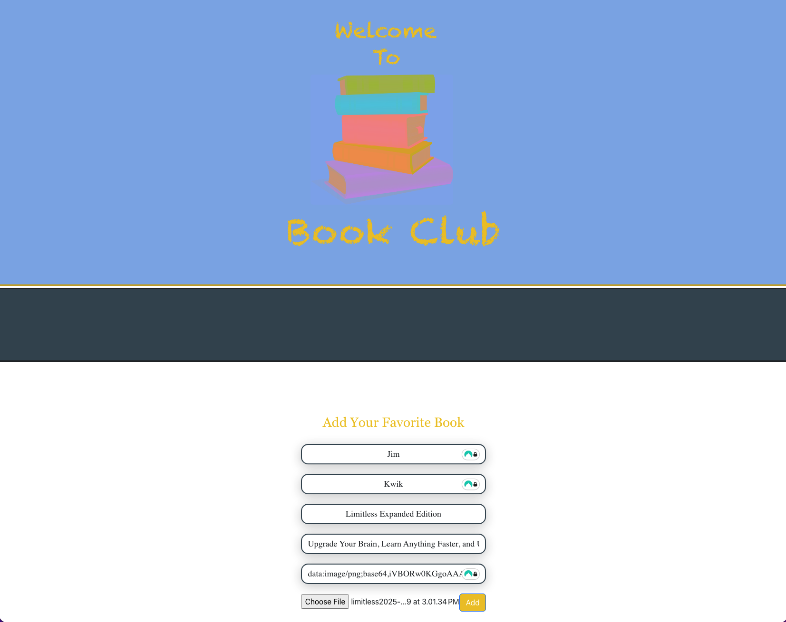

# 📚 BookClub - Social Book Sharing Platform

A full-stack MERN (MongoDB, Express, React, Node.js) application that enables book enthusiasts to share their favorite reads, discover new books, and connect with fellow readers through a modern, responsive web interface.

   

## 🎯 Project Overview

BookClub is a social platform where users can:
- Share their favorite books with the community
- Upload book covers and detailed descriptions
- Browse books shared by other members
- Manage their personal book collections
- Connect with other readers through shared interests

**Live Demo:** [Add deployment link if available]  
**Portfolio Article:** [Link to Medium article if written]

---

## 📸 Screenshots

### Book Detail & Edit Page

*Individual book view with editing capabilities and metadata*

### Home Page with Book Collection

*Social book sharing interface displaying user-submitted books with cover images*

### Add Book Form

*React-based form with validation and image upload functionality*

---

## 🚀 Features

### User Management
- **User Authentication:** Secure registration and login system
- **Profile Management:** Personalized user profiles with book collections
- **Session Handling:** Persistent user sessions with secure token management

### Book Management
- **Add Books:** Upload book information with cover images (base64 encoding)
- **Edit Books:** Update book details and descriptions
- **Delete Books:** Remove books from personal collection
- **Book Details:** Detailed view pages for each book with author information

### User Experience
- **Responsive Design:** Mobile-first approach using React Bootstrap
- **Image Upload:** Direct image upload with base64 conversion
- **Real-time Updates:** Dynamic content updates without page refresh
- **User-Friendly Forms:** Form validation with helpful error messages

---

## 🛠️ Tech Stack

### Frontend
- **React 18.2.0** - Modern UI library with hooks
- **React Router DOM 6.8.1** - Client-side routing
- **React Bootstrap 2.7.0** - Responsive component library
- **Axios** - HTTP client for API communication
- **React-File-Base64** - Image upload and encoding

### Backend
- **Node.js** - JavaScript runtime
- **Express 4.18.2** - Web application framework
- **MongoDB** - NoSQL database
- **Mongoose 6.9.1** - MongoDB object modeling
- **CORS** - Cross-Origin Resource Sharing enabled

### Development Tools
- **Create React App** - Development environment
- **ESLint** - Code quality and consistency
- **React Testing Library** - Component testing framework

---

## 📁 Project Structure

```
BookClub/
├── client/                  # React frontend application
│   ├── public/             # Static files
│   ├── src/
│   │   ├── components/     # React components
│   │   │   ├── AddBook.js           # Book creation form
│   │   │   ├── BookDetailPage.js    # Individual book display
│   │   │   ├── Registration.js      # User signup
│   │   │   ├── SignIn.js           # User authentication
│   │   │   └── UploaderEditPage.js # Book editing interface
│   │   ├── App.js          # Main application component
│   │   └── index.js        # Application entry point
│   └── package.json        # Frontend dependencies
│
├── server/                 # Node.js backend application
│   ├── config/            # Database configuration
│   ├── controllers/       # Business logic
│   ├── models/           # Mongoose schemas
│   │   ├── book.model.js       # Book data model
│   │   └── user.model.js       # User data model
│   ├── routes/           # API endpoints
│   │   ├── book.route.js
│   │   └── user.route.js
│   ├── server.js         # Express server setup
│   └── package.json      # Backend dependencies
│
└── README.md            # This file
```

---

## 🔧 Installation & Setup

### Prerequisites
- Node.js (v14 or higher)
- MongoDB (local installation or MongoDB Atlas account)
- npm or yarn package manager

### Backend Setup

1. **Navigate to server directory:**
   ```bash
   cd BookClub/server
   ```

2. **Install dependencies:**
   ```bash
   npm install
   ```

3. **Configure MongoDB connection:**
   - Create `config/mongoose.config.js` with your MongoDB URI
   ```javascript
   const mongoose = require("mongoose");
   const DB_NAME = "bookclub_db";

   mongoose.connect(`mongodb://localhost/${DB_NAME}`, {
     useNewUrlParser: true,
     useUnifiedTopology: true,
   })
   .then(() => console.log(`Connected to ${DB_NAME} database`))
   .catch((err) => console.log("Database connection error:", err));
   ```

4. **Start the server:**
   ```bash
   node server.js
   ```
   Server runs on `http://localhost:8000`

### Frontend Setup

1. **Navigate to client directory:**
   ```bash
   cd BookClub/client
   ```

2. **Install dependencies:**
   ```bash
   npm install
   ```

3. **Start the development server:**
   ```bash
   npm start
   ```
   Application runs on `http://localhost:3000`

---

## 🔌 API Endpoints

### Books API
- `GET /api/books` - Retrieve all books
- `GET /api/books/:id` - Get specific book details
- `POST /api/books` - Create new book entry
- `PUT /api/books/:id` - Update book information
- `DELETE /api/books/:id` - Remove book from database

### Users API
- `POST /api/users/register` - Register new user
- `POST /api/users/login` - Authenticate user
- `GET /api/users/:id` - Get user profile
- `PUT /api/users/:id` - Update user information

---

## 💡 Key Technical Implementations

### Image Handling
- Implemented base64 encoding for image uploads
- Configured Express with 50MB payload limit for image data
- Direct image-to-database storage without external file hosting

### State Management
- React hooks (useState, useEffect) for component state
- Axios interceptors for API error handling
- React Router for navigation state

### Data Validation
- Mongoose schema validation on backend
- Frontend form validation with React Bootstrap
- Custom error messages for user feedback

### Security Features
- CORS configuration for cross-origin requests
- Input sanitization on server side
- Mongoose validation for data integrity

---

## 🎓 Learning Outcomes

This project demonstrates proficiency in:
- **Full-Stack Development:** End-to-end application development from database to UI
- **RESTful API Design:** Creating scalable and maintainable API endpoints
- **React Development:** Modern React patterns using hooks and functional components
- **Database Design:** MongoDB schema design with Mongoose ODM
- **State Management:** Handling application state across components
- **User Authentication:** Implementing secure user registration and login systems
- **Responsive Design:** Creating mobile-friendly interfaces with Bootstrap
- **Image Processing:** Handling file uploads and base64 encoding

---

## 🚀 Future Enhancements

- [ ] User authentication with JWT tokens
- [ ] Book rating and review system
- [ ] Search and filter functionality
- [ ] Favorite books collection
- [ ] Social features (following users, comments)
- [ ] External API integration (Google Books API)
- [ ] Book recommendation algorithm
- [ ] Dark mode theme
- [ ] Email notifications
- [ ] Advanced image optimization

---

## 📝 Development Notes

### Known Issues
- Image sizes limited to 50MB payload
- CORS configured for localhost only (needs update for production)
- No persistent authentication tokens (requires JWT implementation)

### Performance Considerations
- Large images increase database size
- Consider implementing CDN for production
- Add pagination for book lists with many entries

---

## 👨‍💻 Author

**Cortillius McKinney**
- GitHub: [@CortilliusMckinney](https://github.com/CortilliusMckinney)
- LinkedIn: [cortillius-mckinney](https://www.linkedin.com/in/cortillius-mckinney-1772a216a/)
- Medium: [@cortilliusmckinney](https://medium.com/@cortilliusmckinney)
- Email: cortilliusmckinney@gmail.com

---

## 📄 License

This project is open source and available for educational purposes.

---

## 🙏 Acknowledgments

- Created as part of MERN stack development training
- Inspired by social reading platforms like Goodreads
- Built with modern web development best practices

---

## 🔗 Related Projects

Check out my other full-stack and DevOps projects:
- [Agentic DevOps Pipeline](https://github.com/CortilliusMckinney/gcp-agentic-devops) - AI-powered DevOps automation
- [Azure Infrastructure as Code](https://github.com/CortilliusMckinney/azure-iac-project) - Terraform-based Azure deployment
- [Medium Articles](https://medium.com/@cortilliusmckinney) - Technical writing on cloud and DevOps

---

**⭐ If you find this project useful, please consider giving it a star!**
